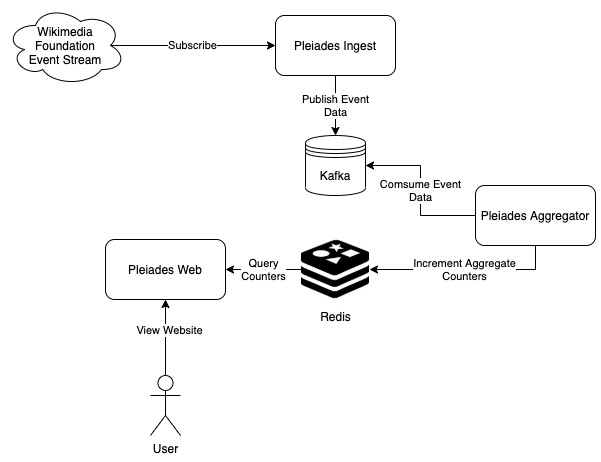

# Pleiades - A WMF Event Stream Aggregator

* _Note: Pleiades is a demonstration project, provided as-is_


Pleiades is a data aggregator that transforms information on editing events of the world's Wikipedias and associated Wikis into aggregate data
which may be used, e.g. to calculate trends over time.

More specifically, Pleiades subscribes to the `recentchange` event stream [provided by the Wikimedia Foundation](https://wikitech.wikimedia.org/wiki/Event_Platform/EventStreams) and re-publishes each event received to either a Kafka topic or a separate file on the filesystem.
These events are then aggregated into per-day Redis counters which can be visualised using a built-in web frontend.

Pleiades supports resuming subscriptions of the WMF stream from historic event IDs in case of interruption.

Prometheus metrics are provided on `/metrics`.


## Architecture




### Ingest

The Pleiades Ingester consumes events published on the WMF `recentchange` stream. Each event contains a timestamp and payload data.
The payload describes metadata of the change event that took place.

Since there is no way to partition the ingest, only a single ingester can run at a time. In order to keep throughput high and allow it to keep
up with even large load spikes, it performs no processing on the received events, instead simply writing the event to a Kafka topic.

The use of Kafka has a number of advantages:
* It creates a buffer between ingest and aggregation and allows fanning out the data one event at a time to multiple aggregators
* It provides persistence, allowing a failed aggregation to be repeated
* It enables additional consumers to be added in the future, e.g. ƒor publishing the event data to Elasticsearch


### Aggregation

The Pleiades Aggregators form a Kafka consumergroup, cooperatively reading events from Kafka and parsing the contents. They then calculate
counter increments based on event data, e.g. identifying the Wiki the change occurred on, whether it was performed by a bot user and so on.
These counters are then incremented in Redis.


### Web

The Pleiades Web frontend serves a web application that uses REST API endpoints to retrieve and visualise the Redis data as graphs.


## Usage

Pleiades is build as a multi-personality binary, supporting the modes `ingest`, `aggregate` and `frontend`.

Example usate:
```
$ pleiades help ingest
ingest starts the ingest server.
It will begin consuming the WMF stream and publish received events to the configured publisher.

Usage:
  pleiades ingest [flags]

Flags:
      --file.enable              enable the filesystem publisher
      --file.publishDir string   the directory to publish events to (default "./events")
  -h, --help                     help for ingest
      --kafka.broker string      the kafka broker to connect to (default "localhost:9092")
      --kafka.enable             enable the kafka publisher
      --kafka.topic string       the kafka topic to publish to (default "pleiades-events")
      --metricsPort string       the port to serve Prometheus metrics on (default "9000")
  -r, --resume                   try to resume from last seen event ID (default true)

Global Flags:
  -q, --quiet     suppress all output except for errors
  -v, --verbose   enable verbose output

  ```

*Notes:*
* Only one publisher can be enabled at a time, use either `--file.enable` or `--kafka.enable`.
* `--metricsPort` sets the port to use for the Prometheus metrics endpoint (see below)
* `--kafka.broker` and `--kafka.topic` set the broker and topic to publish do when using Kafka
  Please note that currently only one single broker and single-partition topic is supported
* When using the file publisher, `--file.publishDir` sets the directory on the filesystem to store events
  If it does not exist, it will be created
* `-q` and `-v` are mutually exclusive and decrease or increase the log level respectively
* Setting `-r=false` will disable the subscription resume mechanism and start consuming events from the current point in time


## Metrics

Pleiades exposes the following metrics in addition to the standard go runtime stats:

| name | type | help |
|------|------|------|
| `pleiades_recv_events_total` | counter | Total number of parsed events recenved from upstream |
| `pleiades_recv_event_lines_total` | counter | Total number of raw lines read from upstream, regardless of whether they become part of an event object |
| `pleiades_recv_errors_total` | counter | Total number of errors encountered by the consumer |
| `pleiades_goroutine_restarts` | counter | Number of times any of the interal goroutines restarted after encountering an error |
| `pleiades_[file,kafka]_publish_events_total` | counter | Total number of events published |
| `pleiades_[file,kafka]_publish_errors_total` | counter | Total number of errors encountered while publishing - each is likely to have dropped one event |
| `pleiades_kafka_publish_events_total` | counter | Total number of events published to Kafka |
| `pleiades_kafka_publish_writes_total` | counter | Total number of write operations published to Kafka |
| `pleiades_kafka_writer_errors_total` | counter | Total number of errors encountered while publishing to Kafka - each is likely to have dropped one event |
| `pleiades_kafka_publish_write_time_seconds` | gauge | Time spent writing to Kafka ('min', 'max', 'avg') |
| `pleiades_kafka_publish_wait_time_seconds` | gauge | Time spent waiting for Kafka responses ('min', 'max', 'avg') |
| `pleiades_kafka_publish_lag_milliseconds` | gauge | Time difference between receiving an event from upstream and publishing to Kafka |
| `pleiades_aggregator_event_count_total` | count | Total number of events aggregated |
| `pleiades_aggregator_message_lag_milliseconds` | histogram | Age of events at aggregation |
| `pleiades_web_http_response_total` | counter | Total number of HTTP responses by path and status code |
| `pleiades_web_http_duration_seconds` | histogram | Time taken to generate responses |
| `pleiades_web_counter_marshal_duration_seconds` | histogram | Time taken to marshal JSON for response bodies |


## Running in KIND (WIP)

[Kind](https://kind.sigs.k8s.io/) (or kubernetes-in-docker) is a tool for standing up kubernetes clusters on your local machine for testing purposes.

The `/deploy/kind` folder contains all relevant descriptors:

* [kind-cluster.yaml](deploy/kind/kind-cluster.yaml) is a  Kind cluster descriptor including host port forwarding for ports `80` and `443` for use with an Ingress Controller
* [strimzi/strimzi.yaml](deploy/kind/strimzi/strimzi.yaml) deploys the [Strimzi Kafka Operator](https://strimzi.io/)
* [prometheus/](deploy/kind/prometheus) contains descriptors for the [Prometheus Operator](https://github.com/prometheus-operator/prometheus-operator), an Ingress and a single Prometheus instance
* [nginx-ingress/](deploy/kind/nginx-ingress/nginx-ingress.yaml) deploys the [Nginx Ingress Controller](https://github.com/kubernetes/ingress-nginx/)
* [pleiades/](deploy/kind/pleiades) contains descriptors for Pleiades itself, the managed Kafka cluster and topic it publishes to, as well as a `ServiceMonitor`

### Putting it all together

#### First, create the Kind cluster
```
$ pwd
pleiades/deploy/kind

$ kind create cluster --config=kind-cluster.yaml

$ kubectl config use-context kind-kind
```

Create the `kafka` namespace
```
$ kubectl create namespace kafka
```

#### Deploy the Ingress Controller and Operators
```
$ kubectl apply -f nginx-ingress/nginx-ingress.yaml
$ kubectl apply -f prometheus-operator-bundle.yaml -f prometheus-servicemonitor.yaml
$ kubectl apply -f strimzi/strimzi.yaml -f strimzi/kafka-podmonitor.yaml
```
and wait for the pods to become ready.

#### Deploy the Prometheus instance and Kafka cluster
```
$ kubectl apply -f prometheus/prometheus-instance.yaml - prometheus/prometheus-ingress.yaml
$ kubectl apply -f pleiades/kafka-persistent-single.yaml
$ kubectl apply -f pleiades/kafkatopic.yaml
```
wait until Kafka is running (again, check Pod readiness)

#### Deploy Pleiades
Build a container image from the repo and transfer it into the Kind cluster, then create a Deployment
```
$ docker build . -t pleiades:<your-tag>
$ kind load docker-image pleiades:<your-tag>
$ kubectl apply -f pleiades/pleiades-*
```

You should be able to access Prometheus on http://localhost/prometheus.
Verify that Prometheus is scraping Pleiades and the Kafka cluster by checking the `Targets` section.
